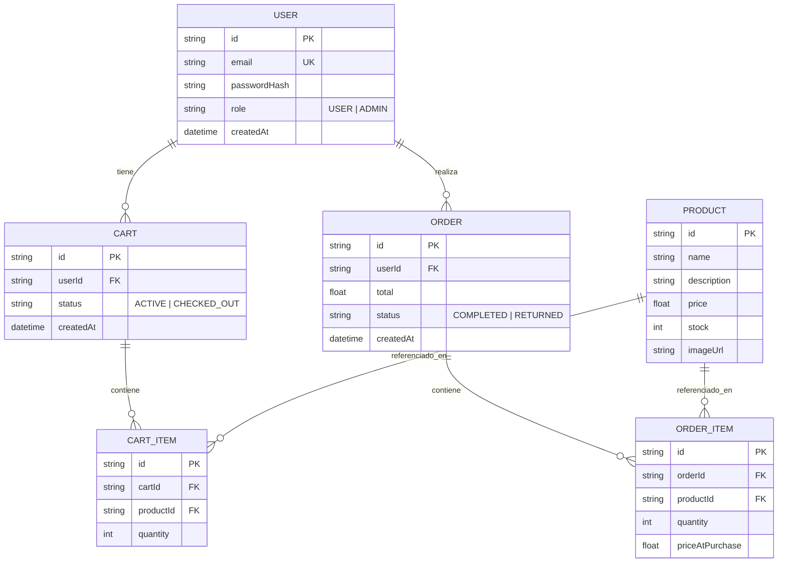

# Ecommerce Backend — Project Break 2

Backend "React Ready" construido con Express 5, Prisma 7 (PostgreSQL/Supabase) y
Mongoose (MongoDB Atlas). JWT en cookie httpOnly para autenticación.

## Stack

- Node.js + Express 5
- Prisma 7 + `@prisma/adapter-pg` → PostgreSQL (Supabase): `User`, `Product`, `Cart`, `CartItem`, `Order`, `OrderItem`
- Mongoose → MongoDB Atlas: `Review`, `Wishlist`
- JWT (cookie httpOnly) + bcryptjs
- Swagger UI en `/api/docs`

## Desarrollo local

```bash
npm install
cp .env.example .env   # y rellena con tus credenciales reales
npx prisma generate
npx prisma db push
npm run dev
```

Cada vez que se modifique `prisma/schema.prisma` (nuevo modelo o campo), hay que repetir:
```bash
npx prisma generate
npx prisma db push
```

## Documentación de la API

Con el servidor corriendo: **http://localhost:3000/api/docs**

## Variables de entorno

Ver `.env.example`. Resumen:

| Variable | Para qué |
|---|---|
| `DATABASE_URL` / `DIRECT_URL` | Conexión a Supabase (pooler / directa) |
| `MONGO_URI` | Conexión a MongoDB Atlas |
| `JWT_SECRET` / `JWT_EXPIRES_IN` | Firma de los JWT |
| `CLIENT_URL` | Origen permitido en CORS (la URL del frontend React) |
| `PORT` / `NODE_ENV` | Puerto del servidor y entorno |
| `CLOUDINARY_*` | Subida de imágenes (Parte 7) |

## Subida de imágenes (Cloudinary)

`POST /api/products/:id/image` (solo ADMIN, `multipart/form-data`, campo `image`).
Necesitas una cuenta gratuita en https://cloudinary.com y rellenar en `.env`:
`CLOUDINARY_CLOUD_NAME`, `CLOUDINARY_API_KEY`, `CLOUDINARY_API_SECRET`
(Dashboard de Cloudinary → los tres valores están ahí arriba, listos para copiar).

```bash
curl -i -b cookies.txt -X POST http://localhost:3000/api/products/ID_DEL_PRODUCTO/image \
  -F "image=@/ruta/a/camiseta-espana.jpg"
```

## Modelo de datos



`Review` y `Wishlist` viven en MongoDB (no en este diagrama, que es de PostgreSQL):
referencian `productId`/`userId` como strings sueltos, sin relación física real
entre bases de datos (la integridad se valida desde el código, no desde el motor).

## Tests

```bash
npm test
```
Usa Jest + Supertest. Los tests de integración **mockean Prisma** (no tocan tu
Supabase real ni MongoDB), así que puedes ejecutarlos en cualquier momento sin
miedo a ensuciar datos. Cubren: validaciones, auth (register/login/me),
productos (CRUD + permisos ADMIN) y el checkout transaccional del carrito
(incluyendo el caso de stock insuficiente).

## Despliegue en Render

1. Sube el proyecto a un repo de GitHub (si no lo está ya).
2. En [Render](https://render.com) → **New** → **Web Service** → conecta el repo.
3. Configuración del servicio:
   - **Build Command**: `npm install && npx prisma generate`
   - **Start Command**: `npm start`
   - **Environment**: Node
4. En la pestaña **Environment** del servicio, añade TODAS las variables de `.env`
   (con los valores reales) **excepto** `PORT` — Render lo asigna automáticamente
   y nuestro `env.js` ya lo lee con `process.env.PORT`.
5. Importante: pon `NODE_ENV=production` y `CLIENT_URL` apuntando a la URL real
   donde despliegues el frontend (ej. `https://tu-frontend.vercel.app`), sin la
   barra final. Esto activa automáticamente `secure: true` y `sameSite: "none"`
   en la cookie de auth (necesario porque en producción frontend y backend
   viven en dominios distintos).
6. Despliega. La primera vez, como el build no ejecuta `db push`, asegúrate de
   haber sincronizado el esquema contra la **misma** base de Supabase antes
   (puedes hacerlo desde tu máquina apuntando al `.env` de producción, o añadir
   `npx prisma db push` puntualmente al Build Command la primera vez).
7. Verifica con `https://tu-backend.onrender.com/health` y
   `https://tu-backend.onrender.com/api/docs`.

### Nota sobre el plan free de Render
Los servicios free "duermen" tras un rato de inactividad y tardan unos segundos
en despertar con la siguiente petición — es normal, no es un fallo de la API.
