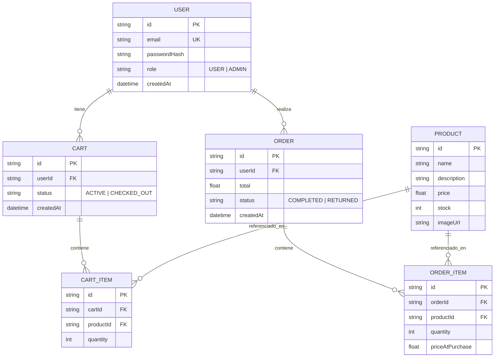

# Ecommerce Backend — Project Break 2

Backend de un e-commerce de camisetas de fútbol, desarrollado como entrega del
**Project Break 2** del módulo de backend (Sprints 7-12) de The Bridge.

🚀 **API en producción**: https://ecommerce-backend-pb2.onrender.com
📚 **Documentación interactiva (Swagger)**: https://ecommerce-backend-pb2.onrender.com/api/docs
❤️ **Health check**: https://ecommerce-backend-pb2.onrender.com/health

> El plan free de Render "duerme" el servicio tras un rato de inactividad. La
> primera petición tras un período sin uso puede tardar unos segundos en
> responder mientras el servicio despierta; es comportamiento normal del plan,
> no un fallo de la API.

## Sobre el proyecto

Este proyecto es el backend de una tienda de camisetas de fútbol del **Mundial 2026**,
desarrollado con fines estrictamente educativos como entrega del Project Break 2.
El catálogo incluye las 32 selecciones clasificadas a dieciseisavos de final del
torneo: una camiseta por selección, con descripción, precio, stock y una imagen
representativa de cada equipo.

Las imágenes del catálogo han sido generadas con herramientas de inteligencia
artificial y están libres de derechos de autor. Se han creado expresamente para
este ejercicio con el fin de evitar cualquier conflicto con marcas registradas,
licencias deportivas o derechos de imagen asociados a las equipaciones reales.
Su uso es exclusivamente ilustrativo y académico.

## Stack

- Node.js + Express 5
- Prisma 7 + `@prisma/adapter-pg` → PostgreSQL (Supabase): `User`, `Product`, `Cart`, `CartItem`, `Order`, `OrderItem`
- Mongoose → MongoDB Atlas: `Review`, `Wishlist`
- JWT en cookie httpOnly + bcryptjs, para autenticación y roles (`USER` / `ADMIN`)
- Cloudinary, para las imágenes de los productos
- Swagger UI, para la documentación interactiva
- Jest + Supertest, para los tests automáticos
- Desplegado en Render

## Funcionalidades implementadas

**Autenticación y autorización** — `POST /api/auth/register`, `POST /api/auth/login`,
`POST /api/auth/logout`, `GET /api/me`. JWT guardado en cookie httpOnly; rutas
protegidas con middlewares `authenticate` y `requireRole("ADMIN")`.

**Productos** — CRUD completo (`GET`/`POST`/`PUT`/`DELETE /api/products`),
lectura pública y escritura solo para ADMIN. Soporta búsqueda (`?search=`) y
orden por precio (`?sort=price_asc|price_desc`).

**Reviews y wishlist** (MongoDB) — `GET`/`POST /api/products/:id/reviews`,
`DELETE /api/reviews/:reviewId`, y `GET`/`POST`/`DELETE /api/wishlist/:productId`.
Antes de escribir en Mongo se valida en Postgres que el producto exista.

**Carrito y checkout** — `GET /api/cart`, `POST /api/cart/items`,
`PUT`/`DELETE /api/cart/items/:itemId`, y `POST /api/cart/checkout`. El checkout
corre dentro de una transacción (`prisma.$transaction`): comprueba stock,
lo descuenta, crea el `Order` con el precio congelado en `priceAtPurchase`, y
pasa el carrito a `CHECKED_OUT` (queda como historial; el siguiente `addItem`
crea automáticamente un carrito `ACTIVE` nuevo).

**Pedidos** — `GET /api/orders` (historial del usuario) y
`POST /api/orders/:id/return`, una funcionalidad añadida por iniciativa propia
(no pedida en el enunciado): repone el stock de cada producto del pedido y lo
marca como `RETURNED`, también de forma transaccional.

**Subida de imágenes** — `POST /api/products/:id/image` (solo ADMIN), sube el
archivo a Cloudinary vía Multer y guarda la URL resultante en `imageUrl`.

## Modelo de datos



`Review` y `Wishlist` viven en MongoDB (no en este diagrama, que es de
PostgreSQL): referencian `productId`/`userId` como strings sueltos, sin
relación física real entre bases de datos — la integridad se valida desde el
código, no desde el motor.

## Probar la API ya desplegada

No hace falta clonar el repo ni instalar nada para probarla: usa directamente
**https://ecommerce-backend-pb2.onrender.com/api/docs**, donde se pueden
ejecutar todos los endpoints desde el navegador (botón "Try it out").

Ejemplo con `curl`:

```bash
# Salud del servicio
curl https://ecommerce-backend-pb2.onrender.com/health

# Catálogo de productos
curl https://ecommerce-backend-pb2.onrender.com/api/products

# Registro de usuario
curl -i -c cookies.txt -X POST https://ecommerce-backend-pb2.onrender.com/api/auth/register \
  -H "Content-Type: application/json" \
  -d '{"email":"test@test.com","password":"123456"}'

# Usuario autenticado actual (usando la cookie guardada arriba)
curl -b cookies.txt https://ecommerce-backend-pb2.onrender.com/api/me
```

## Tests

```bash
npm test
```
34 tests con Jest + Supertest. Los de integración **mockean Prisma** (no tocan
Supabase ni MongoDB reales), así que se pueden ejecutar en cualquier momento
sin riesgo de ensuciar datos. Cubren: validaciones, autenticación
(register/login/me), productos (CRUD + permisos de ADMIN), checkout
transaccional del carrito (incluyendo stock insuficiente) y devolución de
pedidos.

## Ejecutar el proyecto en local

```bash
npm install
cp .env.example .env   # y rellenar con credenciales propias de Supabase, MongoDB Atlas, JWT y Cloudinary
npx prisma generate
npx prisma db push
npm run dev
```

Servirá en `http://localhost:3000`, con su propia documentación en
`http://localhost:3000/api/docs`.

Cada vez que se modifique `prisma/schema.prisma` (nuevo modelo o campo), hay
que repetir `npx prisma generate` y `npx prisma db push`.

### Variables de entorno

| Variable | Para qué |
|---|---|
| `DATABASE_URL` / `DIRECT_URL` | Conexión a Supabase (pooler / directa) |
| `MONGO_URI` | Conexión a MongoDB Atlas |
| `JWT_SECRET` / `JWT_EXPIRES_IN` | Firma de los JWT |
| `CLIENT_URL` | Origen permitido en CORS (URL del frontend) |
| `PORT` / `NODE_ENV` | Puerto del servidor y entorno |
| `CLOUDINARY_*` | Credenciales para la subida de imágenes |
